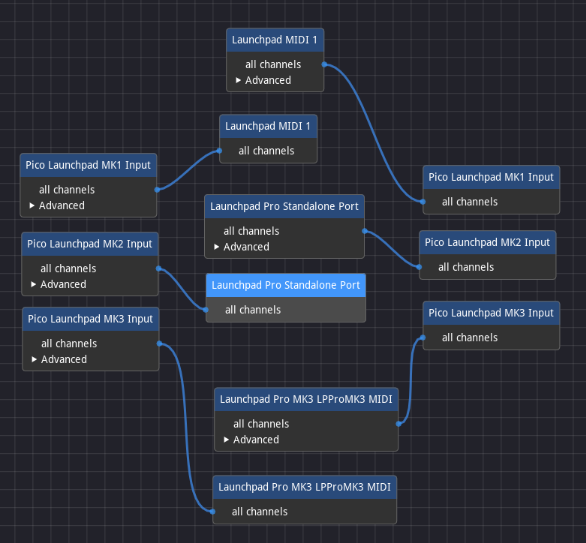

# Pico Isomorphic Launchpad

This project is designed to interact with a supported [Novation
Launchpad](https://novationmusic.com/launchpad) grid controller to provide a
playable [isomorphic layout](https://en.wikipedia.org/wiki/Isomorphic_keyboard).
In short, isomorphic just means that each type of chord (major, minor, et
cetera) has the same relative shape as you move around the grid. 

On an instrument like a guitar or piano, the shape of a C chord is
different from the shape of an A chord, and you have to train yourself to play
in each separate key. On an isomorphic instrument, all shapes and scales are the
same, but shifted by a whole number of rows and columns.

There are a few MIDI controllers that support an isomorphic layout, but the
commercial ones tend to be eye-wateringly expensive. A few years ago, I read
about Tonnetz layout and realised I could "squash" the layout to fit a grid
controller. I created an initial (web-based) version, and much later made [a
Tonnetz layout for a microcontroller with a second USB
port](https://github.com/duhrer/pico-launchpad-tonnetz).

Recently, someone got in touch and inspired me to expand my earlier work to
cover Wicki-Hayden layout as well, and to support switching modes in real time.
They also suggested the rainbow colour scheme I use by default.

With a few old ideas and a few new, I set out to make a suite of isomorphic
tunings for a launchpad that can be applied by connecting the launchpad to a
microcontroller. It currently supports variations on:

1. [Wicki-Hayden](docs/wicki-hayden.md)
2. [Tonnetz](docs/tonnetz.md)
3. [Janko](docs/janko.md)
4. [Piano/Mandolin](docs/piano.md)

## Hardware Prerequisites

To use this project, you first need a supported Novation Launchpad. This project
is currently tested with:

1. The Launchpad Pro MK2
2. The Launchpad Pro MK2 running [a performance-optimized custom
firmware](https://github.com/mat1jaczyyy/lpp-performance-cfw)
3. The Launchpad Pro MK3

You'll also need a compatible micro-controller, i.e. a Raspberry Pi Pico, Pico
2, or compatible third-party unit. If your device has a second USB port, you can
plug the Launchpad directly into that. The "host" code in this project has
mainly been mainly tested with [a RP2350-based Waveshare
unit](https://www.waveshare.com/wiki/RP2350-USB-A), for anything else at a
minimum you'll need to adjust some settings before building and installing binaries.

TODO: Improve the build process across the range of supported boards
TODO: Document how to build for each supported board

## Checking out the Code

This project uses [git
submodules](https://git-scm.com/book/en/v2/Git-Tools-Submodules) for the
libraries it relies on. This means that if you
[clone](https://git-scm.com/docs/git-clone) this repository, you won't have all
the code you need to successfully build binaries.

Although there are multiple ways to manage submodules, the simplest way to get
everything you need is to use a command like:

```
git clone --recurse-submodules https://github.com/duhrer/pico-isomorphic-launchpad.git
```

## Pico SDK and Related Tools

Once you have something to run the code on, you'll need to set up a build
environment. In the past, I have used:

1. The [Getting Started with Pico Guide](https://datasheets.raspberrypi.org/pico/getting-started-with-pico.pdf)
2. The [Pico VS Code extension](https://github.com/raspberrypi/pico-vscode)

Both of those are probably the easiest starting points, and if you hit upon
questions, there are lots of people working with them, so hopefully you can find
the guidance you need.

You can also use the `Dockerfile` in this repository to create a development
container with the necessary tools. As an example. I use
[`podman`](https://podman.io/) and a command like the following to create/update
a comtainer image:

```
podman build --tag pico-sdk .
```

I then use [`distrobox`](https://distrobox.it/) to create and use an instance of
the image created above:

```
distrobox create --image pico-sdk pico-sdk
distrobox enter pico-sdk
```

Within the container, I can then issue build commands as outlined below.

## Building

TODO: Document configuring the board

Once you have a working build environment, you should be able to build the code
in this project using commands like:

```
mkdir -p build
cd build
cmake ..
make -j8
```

You should end up with binaries in various formats.

## Installing on a Microcontroller

The simplest way to install a binary is to boot the microcontroller into
`bootsel` mode. Hold down the `bootsel` button and plug your microcontroller
into USB. A USB drive will appear, and you can copy the
`pico-isomorphic-launchpad.uf2` file generated by the build process onto your
unit. It will process and install the binary if it can. If it doesn't do
anything, make sure you're building for the right processor family, and try
other test binaries, like the examples that come with [the Pico
SDK](https://github.com/raspberrypi/pico-sdk).

If you're lucky enough to have a board with a reset button, all of the binaries
in this project also support entering `bootsel` mode by pressing the reset
button twice. You then copy the `pico-isomorphic-launchpad.uf2` file to the USB
drive as described above.

If you have a [pico probe](https://www.raspberrypi.com/products/debug-probe/) or
other debugging unit, and if your microcontroller exposes the ports you need,
you can use `openocd` to deploy binaries. With this method, you deploy one of
the `pico-isomorphic-launchpad.elf` file generated during the build process.
Check the "[Getting Started with Pico
Guide](https://datasheets.raspberrypi.com/pico/getting-started-with-pico.pdf)"
for more info.

## Setting Up Your Launchpad(s)

### Host Mode

If you have a compatible dual-USB unit, you should be able to connect the
Launchpad to your "host" port, and it should power on. Currently, I can't send
the [System Exclusive
messages](https://midi.org/midi-1-0-universal-system-exclusive-messages)
required to automatically configure a Launchpad connected to the "host" port, so
you'll need to manually enter programmer mode.

On the Launchpad Pro MK2, this is accomplished by holding down the setup button
and then hitting the orange pad in the top row of "modes". The process is
similar for a Launchpad Pro MK2 running the performance-optimized custom
firmware (see above).  Hit the setup button, hit the orange pad in the block of
modes in the upper left of the grid, then hit setup again.

On the Launchpad Pro MK3, you need to hold the setup button in the lower left of
the unit, use the bottom row of controls to change to the "pad" menu, and then
hit the bottom right arrow to switch to programmer mode. Check your user guide
if you need more help than that.

### Client Mode

If you don't have a "host" port on your unit or want to connect more than one
Launchpad at a time, you'll need to connect one or more launchpads on the
"client" side, i.e. using code running on your computer. First, you need to
connect both the microcontroller and the Launchpad to your computer. You'll also
need to configure software like [midiconn](https://github.com/mfep/midiconn) to
route messages in both directions between the microcontroller and the Launchpad,
as shown here:

TODO: Create updated diagram with correct names



The key thing to note is that each generation has different ports that need to
be used. The first generation only has one input and output, those connect to
the MK1 input and output as shown above. The Launchpad Pro MK2 has three inputs
and three outputs, the second of each set ("Standalone") is the one you need to
connoect to the MK2 input and output. The Launchpad Pro MK3 has multiple virtual
ports, but you only need to connect the first in each set (the one labelled
"MIDI").

TODO: Instructions for connecting a custom firmware in client mode

## Actually Using Everything

Now that you've set up all your hardware and software, you can actually play
something. Any notes played will be translated from the layout of the Launchpad
to the selected note layout, and the pads on the launchpad will be lit up to
indicate the layout as well as which notes are held.

### Selecting the Note Layout

The bottom row of circular pads controls which "note layout" and colour scheme
is used.  From left to right:

1. [Wicki-Hayden](docs/wicki-hayden.md), "Unstaggered" clockwise (default)
2. [Wicki-Hayden](docs/wicki-hayden.md), "Unstaggered" counterclockwise
3. [Tonnetz](docs/tonnetz.md), "Unstaggered" clockwise
4. [Tonnetz](docs/tonnetz.md), "Unstaggered" counterclockwise
5. [Tonnetz](docs/tonnetz.md), "Staggered" layout, rotated
6. [Janko](docs/janko.md), "Unstaggered" clockwise
7. [Janko](docs/janko.md), "Unstaggered" counterclockwise
8. [Piano/Mandolin](docs/piano.md)

### Selecting the Colour Scheme

The right row of circular pads controls which "note layout" and colour scheme is
used.  From top to bottom:

1. *Currently unused*
2. *Currently unused*
3. *Currently unused*
4. *Currently unused*
5. *Currently unused*
6. "Rainbow" colour scheme
7. "Red Cs" colour scheme
8. Strong/Subtle Blues

#### Rainbow

In this colour scheme, each of the seven "naturals" has its own colour. All
sharps and flats are black (unlit). Any pad that's held down will be more
strongly coloured.

#### Red Cs

In this colour scheme, all C notes are highlighted in red. The rest of the
"naturals" are highlighted in white. All sharps and flats are black (unlit). Any
pad that's held down will be highlighted in blue.

#### Strong/Subtle Blues

This scheme was adapted from the diagrams on the [Wikipedia page on
Wicki-Hayden](https://en.wikipedia.org/wiki/Wicki%E2%80%93Hayden_note_layout).
Naturals are presented in "islands" of solid blue (C, D, E) and white (F, G, A,
B). The corresponding sharps/flats for each "island" are coloured to match, i.e.
C# and D# are light blue, F#, G#, A# are black. White and black are paired,
strong blue and light blue are paired. Held notes are highlighted in orange.

In my opinion, this colour scheme is most useful for layouts where there are
continuous groups of naturals and sharps/flats, such as
[Wicki-Hayden](docs/wicki-hayden.md) and [Janko](docs/janko.md) 

### Adjusting the Note Range

The Launchpad provides an 8x8 "viewport" of the overall layout. If you want to
reach a different range of notes, you can adjust the note range using the arrow
pads on your Launchpad. The left and right arrows adjust the pitch by one
"column". The up and down arrows adjust the pitch by one "row".

These whole note "offsets" are shared between layouts, but not between devices.
Offsets are tracked for as long as the microcontroller is powered on, but are
not persisted across restarts.

The viewport will stay within the range of playable notes for MIDI, i.e. 0-127.
The lower left note is always the lowest, and cannot be any lower
than note 0 (C-1). [Tonnetz layout](./docs/tonnetz.md) has 53 notes between the
lower left and upper right pads. [Wicki-Hayden layout](./docs/wicki-hayden.md)
has 49 notes between the lower left and upper right pads. As the offset is
shared between all modes, the highest offset is 74. This means that the top four
notes in the MIDI range are not reachable from the Tonnetz layout.


### Using Multiple Launchpads

Although you can only connect one Launchpad to the "host" port (see above), you
can connect as many as you like in "client mode" (see above). The default tuning
can be "tiled" both vertically and horizontally. Using the defaults, this will
result in "jumps" from one octave to another.

If you want to fix this, you can adjust the note range (see above). For example,
if you're setting a second Launchpad to the right of another, you would hit the
right arrow eight times to align it.

Note that all adjustments on the client side are "per family", i.e. everything
connected to the `MK3` output will use (and control) the same offset. If you
have two devices in the same family, connect one to the "host" port and the
other to the "client" side.

