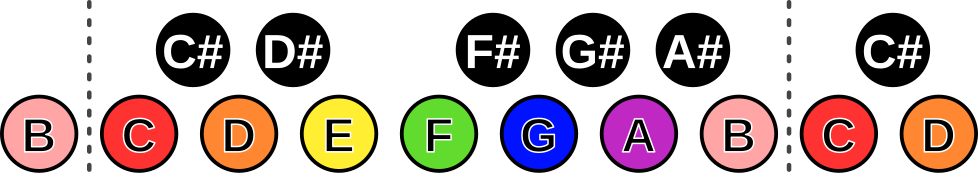
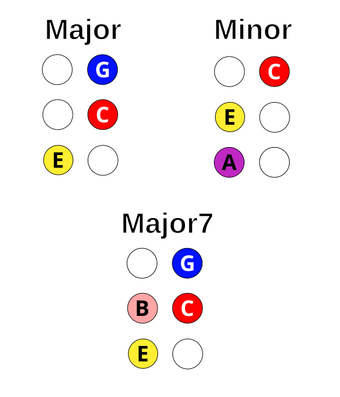

# Making Chords

To help understand the layout, let's first look at the layout of a piano
keyboard:

These colours correspond to the default "rainbow" colour scheme. For
consistency, we'll use these to illustrate various arrangements of notes.

To make a major chord, we want a root (zero) note, four semitones higher than
the root, and then seven semitones higher than the root. In the case of the
piano, the C major chord looks like:

For a minor chord, we want a root (zero) note, three semitones higher than the
root, and then seven semitones higher than the root. In the case of the piano,
an A minor chord looks like:

To extend our major chord example a little, if we start with our major chord and
extend it to includes the note eleven semitones higher than the root, we have
the pattern for [a major 7th
chord](https://en.wikipedia.org/wiki/Major_seventh_chord):

Now that we recognise the colours for these types of chords, we can quickly
compare the shapes these colours make in other layouts. This is not an
exhaustive list of permutations, just a representative sampling of tightly
grouped chords.

## Wicki-Hayden

### Unstaggered Clockwise

### Unstaggered Counterclockwise

## Tonnetz

### Unstaggered Clockwise

### Unstaggered Counterclockwise

### Staggered and Rotated

## Janko

Although you can make chord patterns with the Janko layouts, they tend to be
quite spread out.  You can use the colours in the examples above to find one or
more shapes.

## Piano/Mandolin

This tuning corresponds to the default tuning of a Mandolin, so you can play
(rotated) tablature from a mandolin by aligning yourself with an E key. However,
these are fairly loose chords, here are some tighter examples of common chord
structures:

