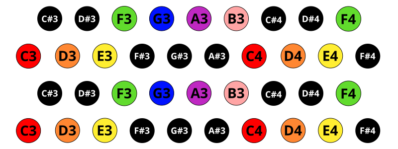

# Janko Layout

[Janko Layout](https://en.wikipedia.org/wiki/Jank%C3%B3_keyboard) staggers the
naturals and sharps/flats between rows, so that each left/right movement is a
whole step, and the half steps are always available above and to the right of a
note:

The even and odd rows have the same whole step separation as
[Wicki-Hayden](wicki-hayden.md). The rows are interleaved differently, so that
the semitones are always available on the diagonals.

To arrange this "staggered" layout on a grid, we have two strategies.  We can
either rotate the layout so that the original rows are arranged along the
diagonals of the launchpad, or "skew" the rows in one direction or the other.

As the grid controller is not an actual hex grid, rotating the staggered layout
collapses the distance between every two rows in the staggered layout, which
results in stripes of the same note (in different octaves), and is less useful
as a playing surface.

Instead, we focus on skewing the staggered layout a half pad clockwise and
counterclockwise.

## Unstaggered Clockwise

## Unstaggered Counterclockwise