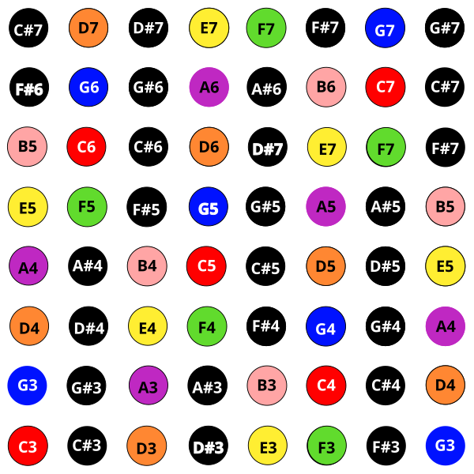

# Piano/Mandolin

Like the built-in "piano" arrangement on the Launchpad Pro, this layout places
each note a single semitone away from its left and right neighbours. Unlike the
Launchpad Pro, the rows are arranged seven semitones apart, as illustrated here
using the default "Rainbow" colour scheme:

# Mandolin Chords

This tuning corresponds to the default tuning of a Mandolin, so you can play
(rotated) tablature from a mandolin on the 7th fret or lower. Here's a sample
mandolin chord, with empty circles for open frets and closed for held frets:

The open first string on the bottom left is the G string, so if we line up with
that, we can construct a chord like:

Once you know the colors involved, you can pare down redundant notes like the
duplicate E notes in the above, and then look for tighter groupings of the same
colours. These are fairly loose chords, here are some tighter examples of common chord
structures:

