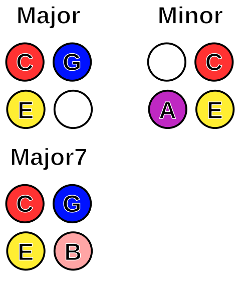
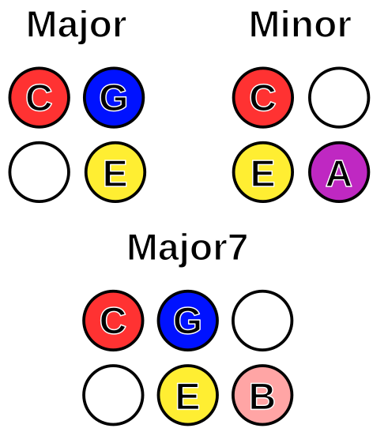
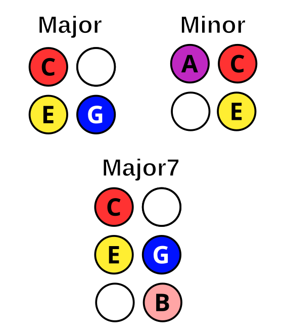

# Tonnetz Note Layout

[Tonnetz layout](https://en.wikipedia.org/wiki/Tonnetz) was developed to help
understand musical relationships (such as forming chords).

The original Tonnetz layout is arranged in "staggered" fashion, where each row
of notes is offset by half to form a hexagonal grid:

To arrange this "staggered" layout grid, we have two strategies.  We can either
"skew" the rows in one direction or the other, or we can rotate the layout so
that the original rows are arranged along the diagonals of the launchpad.

## Skewed Clockwise

In this arrangement, we skew the staggered layout clockwise, which results in
the following layout:

In this layout, octaves are always three rows above or below the current note.
As with the original layout, each pad is a perfect fifth (seven semi-tones) away
from its left and right neighbours. We can move a single semitone by traveling
along the northwest/southeast diagonal.

## Skewed Counterclockwise

In this arrangement, the staggered layout is skewed counterclockwise, which
results in the following layout:

 
 Octaves are still three rows apart. Each pad is still a perfect fifth (seven
 semitones) from its left and right neighbours. Semitones are not directly
 adjacent to each other.

## Chords

### Unstaggered Clockwise

### Unstaggered Counterclockwise

### Staggered and Rotated

For information on making chords in all layouts, check out the [chords
page](./chords.md).