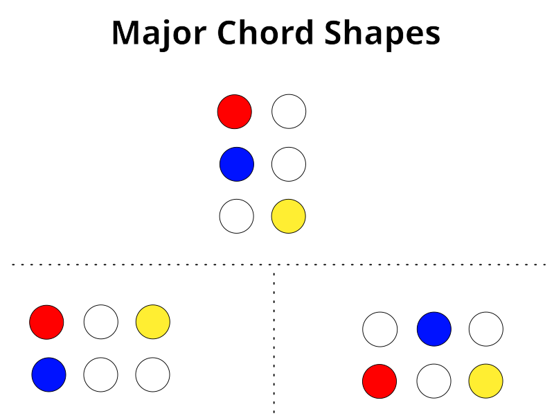
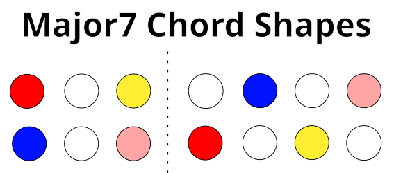
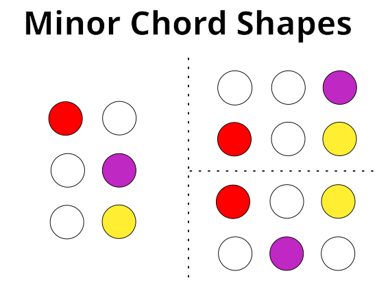
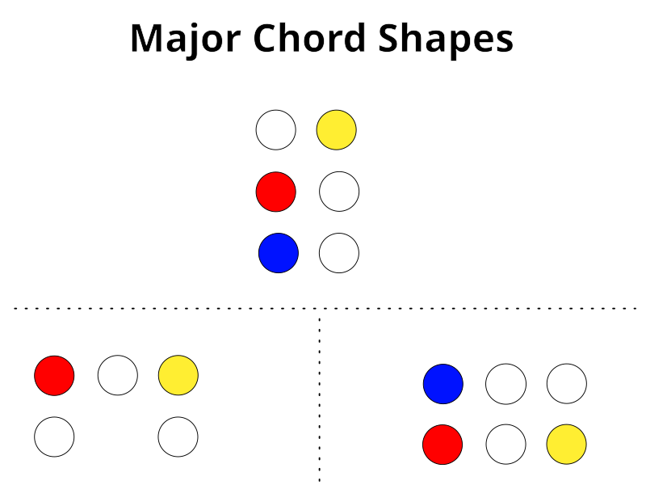
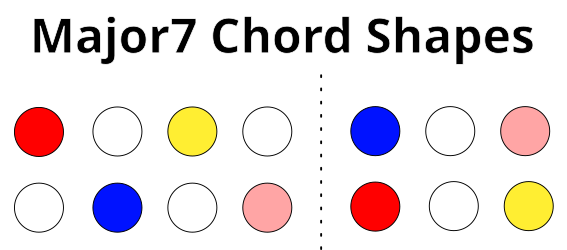
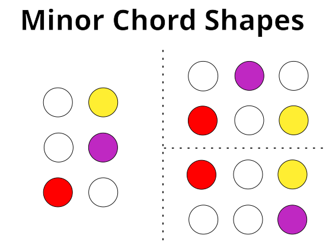

# Wicki-Hayden Note Layout

[Wicki-Hayden note
layout](https://en.wikipedia.org/wiki/Wicki%E2%80%93Hayden_note_layout) is an
isomorphic arrangement of keys used for various accordion-like instruments.  

Here is the "staggered" Wicki-Hayden layout typically used in other instruments:

In an isomorphic layout, the relationship of each note to its neighbours is
always consistent. In Wicki-Hayden layout, octaves are always two rows above or
below the current note. Each move left or right is a whole step.

To arrange this "staggered" layout on a grid, we have two strategies.  We can
either rotate the layout so that the original rows are arranged along the
diagonals of the launchpad, or "skew" the rows in one direction or the other.

As the grid controller is not an actual hex grid, rotating the staggered layout
collapses the distance between every two rows in the staggered layout, which
results in stripes of the same note (in different octaves), and is less useful
as a playing surface.

Instead, we focus on skewing the staggered layout a half pad clockwise and
counterclockwise.

## Skewed Clockwise

In this arrangement, we skew the staggered layout clockwise, which results in
the following layout:

This "unstaggered" layout preserves the rough grouping of naturals and
sharps/flats, and the relationships are very similar. Each move left or right is
still a whole step.

## Skewed Counterclockwise

In this arrangement, we skew the staggered layout counterclockwise, which
results in the following layout:

This is a kind of mirror image of the "counterclockwise" layout, with very
similar patterns.  Each move left or right is still a whole step.

## Chords

### Unstaggered Clockwise

### Unstaggered Counterclockwise

For information, check out the [chords page](./chords.md).